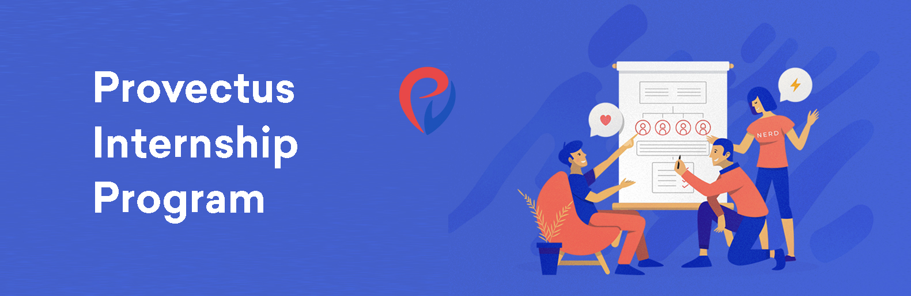

# Provectus Internship Program 

:point_right:  **Open a PR with your completed test assignment, and apply through the [Internship Application Form](https://docs.google.com/forms/d/e/1FAIpQLSfpIozuzxzbFILpA2u7i4H8B4QjKJ-rSXM8Y8qoMw)!**

&nbsp;

## Overview 

This repository contains test assignments for Provectus Internship Program (PIP). PIP is a unique opportunity for students and post-graduates to gain real-world experience working on a diverse variety of high-end projects for foreign (mainly US) clients in experienced teams and pick up in-demand skills. Many of our engineers are certified experts with hands-on experience with large international projects, eager to share their knowledge with interns. After the internship chances are you'll get a job offer from Provectus and stay with us.    

## Test Assignments

Currently two specializations are available for internship: 

- **[DevOps](./devops)**
- **[Frontend](./frontend)**

Pick one and follow the directions in its README.md file.
The test task consists of 2 parts: theory and practice. 
Make sure to complete both and open a PR. Then, fill in this form, add a link to your PR inside it and submit: 

- **[Provectus Internship Application Form](https://docs.google.com/forms/d/e/1FAIpQLSfpIozuzxzbFILpA2u7i4H8B4QjKJ-rSXM8Y8qoMw)**

We will review your application and reply as soon as we can. 

## Provectus Internship Terms

- Internship duration is 3 months
- Internship is unpaid
- Location: Kazan or online
- For Kazan, it's recommended to come to office at least once a week for better teamwork
- To apply, complete both parts of the test assignment (theory and practice) and apply using the [application form](https://docs.google.com/forms/d/e/1FAIpQLSfpIozuzxzbFILpA2u7i4H8B4QjKJ-rSXM8Y8qoMwB0zV4TdQ/viewform) 

## What Interns Get

- Hands-on experience in your field
- Opportunity to learn directly from experts
- Friendly atmosphere and mentorship
- Teamwork experience across a variety of projects 
- Opportunity to play with a variety of modern technologies
- Real-world experience on international projects
- Feedback and recommendations for your CV
- Opportunity to get hired by Provectus full-time

## How to Apply 

1. Decide on your specialization (DevOps or Frontend)
2. Have a Github account & basic Git skills
3. Fork & clone this repository 
4. Complete the assignment in a separate branch
5. Push the branch and open a PR to this repository
6. Fill in the [application form](https://docs.google.com/forms/d/e/1FAIpQLSfpIozuzxzbFILpA2u7i4H8B4QjKJ-rSXM8Y8qoMwB0zV4TdQ/viewform), add a link to your PR, submit. 

## Provectus Opportunities

For current internship and learning opportunities at Provectus and their starting dates, please check out the official Provectus Careers website: 

- [Provectus Careers](https://careers.provectus.com/)
- [Provectus Internship (Kazan)](https://careers.provectus.com/internship-kazan/)
- [Provectus NOC School](https://careers.provectus.com/noc-school-provectus/)

Or send an email to us at: **kazan_internship@provectus.com**

### About Provectus
Provectus is an Artificial Intelligence consultancy and solutions provider, helping companies in Healthcare & Life Sciences, Retail & CPG, Media & Entertainment, Manufacturing, and Internet businesses achieve their objectives through AI. Provectus is headquartered in Palo Alto, CA. For more information, visit **[provectus.com](https://provectus.com/)**.

:tada: Good Luck!
