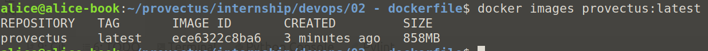
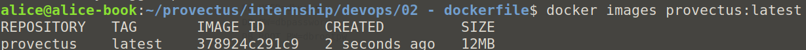

## Prerequsite

* Docker 19.03 or greater

## Legend

A go web application that outputs container_id(hostname) and access count.
There is a dockerfile and application code in current folder.
You need to optimize the Dockerfile by correcting or adding steps.

## Questions

1. What is Docker? Which technology is it based on?

Docker is a tool for developing, building and running applications, separating the application from your infrastructure. Docker is based on containerization. It allows to package and run an application in an isolated environment - container.

2. Look at the Docker file – what would you change in it?

- separate commands into several stages, to decrease the size of the final image
- use lighter base image instead of golang:1.15
- add EXPOSE

3. How do I pass variables to the Docker file when building and running the container?

- `docker build --build-arg <variable>=<value>`
- `docker run -e <variable>=<value> <image>[:<tag>] env`

4. Why do we need multistage build ?

Multistage build allows to reduce the size of container by leaving behind everything that is not required in the final image.

## Tasks

* Dockerfile - generate .env file inside Dockerfile, provide value of port at build step.

* Multi-stage build – change the Dockerfile to make it multi-stage. Try to get the lowest container size.

* Compare size of docker images with and without multistage build.

image without multistage build

image with multistage build

* Write down all commands which you have used.

- `docker build -t provectus:latest .` - to build the image
- `docker images provectus:latest` - to see the information about container
- view Dockerfile to see all the changes