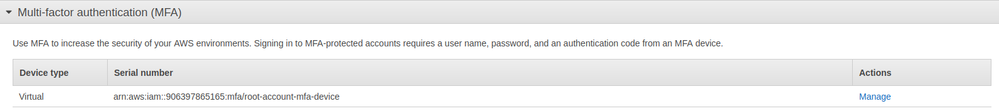

## Prerequsite

* AWS free tier account https://aws.amazon.com/premiumsupport/knowledge-center/create-and-activate-aws-account/

DISCLAIMER: Tasks in this section could be charcheable. Don't keep working resources alone - terminate it. 
Use free tier features and secure your account properly. Deactivate your AWS account if you aren't going 
to use it in the future 

https://aws.amazon.com/free/?all-free-tier.sort-by=item.additionalFields.SortRank&all-free-tier.sort-order=asc&awsf.Free%20Tier%20Types=*all&awsf.Free%20Tier%20Categories=*all


## Tasks

* Create an AWS account and protect the root user with MFA https://docs.aws.amazon.com/IAM/latest/UserGuide/id_root-user.html#id_root-user_manage_mfa



* Create an EC2 instance, connect to it through SSH and install apache or nginx manually, terminate it then. 

```
alice@alice-book:~/provectus$ chmod 400 devops.pem
alice@alice-book:~/provectus$ ssh -i "devops.pem" ubuntu@ec2-34-217-50-254.us-west-2.compute.amazonaws.com
```

```
ubuntu@ip-172-31-24-2:~$ sudo apt update
ubuntu@ip-172-31-24-2:~$ sudo apt install apache2
ubuntu@ip-172-31-24-2:~$ sudo ufw app list
ubuntu@ip-172-31-24-2:~$ sudo ufw allow 'Apache'
```


* Create an EC2 instance, provision software (apache/nginx) using Cloudformation, validate the installation, finally delete the stack. 
  Provide the resulting template as outcome of this task.
  
  Output is in the `ec2apache.yaml` file.

* (*) Given that we have a properly written Cloudformation template come up with an idea how we 
  can create and update a cloudformation stack based on this template automatically. Try to implement it.

## Questions

1. What the benefits of the cloud computing?

- scalability - cloud computer service provider can handle scaling up or down your operation for you
- better collaboration across teams - wherever your team is allocated, you all have access to your service
- reduce cost - it is cheaper to use the resources of your cloud computing service provider rather than purchase expensive systems and equipment
- data availability (fault tolerance) - cloud-based services provide quick data recovery

2. What is the Infrastructure As Code? Pros/cons of it?

It is the process of managing and provisioning infrastructure using config files.
It uses declarative definitions, rather than manual processes.

Pros:
- administrators and operators may automate the configuration process, which allows to improve productivity
- automation may reduce the risk associated with human error

Cons:
- it may be hard to figure out how to configure such infrastucture
- monitoring may be challenging and maybe you will have to find new tools for this  
