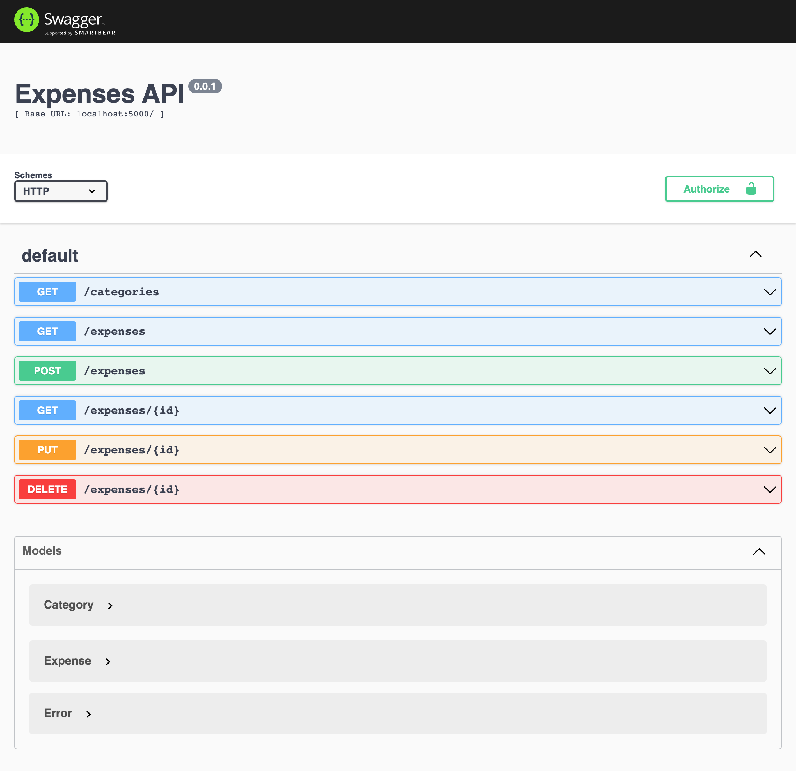

# Provectus Internship Program test assignment
[](https://forthebadge.com) [](https://forthebadge.com)
### Test Assignment
The repository contains the backend part for a simple spend-tracking application written using ME\*N stack.
ME*N stack technologies:
- **MongoDB** - document database
- **Express(.js)** - Node.js web framework
- Any client-side JavaScript framework - React, Angular, Vue, Vanilla JS
- **Node(.js)** - the premier JavaScript web server
### Goals:
You need to write the client side of spend-tracking application using any JS framework / UI kit / libs you like.
Application will need to display, add new, update, remove expenses and track statistics by month and category.
### Getting Started
##### Clone the repo
```
git clone git@github.com:provectus/internship.git
cd /internship/frontend/exercise
```
##### Pre-fill the database with the generated data
```
docker-compose up mongo-seed
```
##### Start the api server
```
docker-compose up api
```
#### Check the api doc generated by the server side
```
http://localhost:5000/api-docs
```

## Acceptance criteria
___
#### Difficulty level : **Easy**
- Minimalistic UI implemented to display / create / update / delete expences
- UI contains chart to display statistics by month and category
- Added comprehensive documentation to launch the application
#### Difficulty level : **Medium**
- The application is written using TypeScript
- The forms contain validations
#### Difficulty level : **High**
- Created Docker image for the front-end application
- Created image used as part of docker-compose.yml
- Added section to run the whole application with one command
