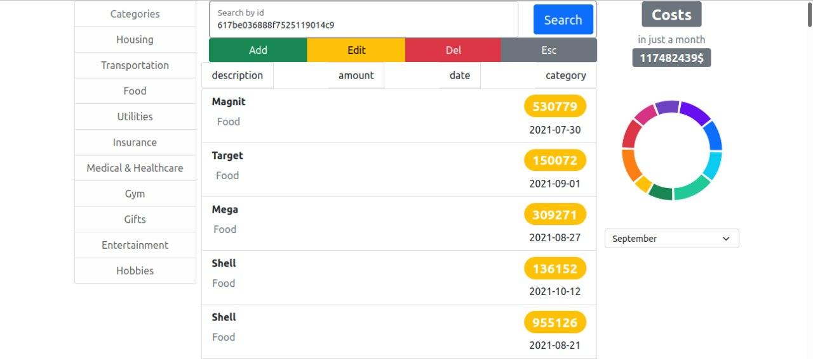

## Hello everyone

For the test task, I chose React. From additional libraries I used Boostrap, Recharts, Typescript. It is also possible to run with Docker (docker-compose).

Let me remind and duplicate the task:
  - Application will need to display, add new, update, remove expenses and track statistics by month and spending category.

Work is on a branch 
```
react-frontend
```
### Getting Started
#### Clone the repo
```
git clone https://github.com/Ya-maz/internship.git
cd ./internship/frontend/exercise
```
#### Pull branches from the remote repository 
```
git branch -r
```
#### Go to the react-frontend branch 
```
git checkout react-frontend
```
#### Supply all docker-compose settings 
```
docker-compose up
```
#### Check the api doc generated by the server side
```
http://localhost:5000/api-docs
```

#### Check your localhost
```
http://localhost:3000/
```




## Как работает приложение
___
 Основная страница содержит три колонки
1. Список категорий. Тут можно выбрать определенную категорию.
2. Список затрат. Отображает список в зависимости от выбранной категории.
3. Статистика по затратам. В зависимости от выбранного месяца оторбражется: в виде ярлыка сумма всех затрат за выбранный месяц, в виде кружка затрат по категориям за выбранный месяц.

Колонка список категорий. Тут все просто - реализован выбор категорий.

Колонка список затрат. Есть поле ввода, ниже группа кнопок, ниже сам список затрат. Поле ввода по умолчанию - поиск. Можно поменять поле ввода нажав на одну из кнопок из группы кнопок(Add, Edit, Del, Esc).
Для добавления новой строчки в список затрат
  - нужно нажать на кнопку Add. Заполнить все 4 поля ввода
  - поле Cost работает только с number
  - поле Date требуется указания даты и времени (am/pm)
  - поле Shop подразумивает название магазина и услуги. Принимает string
  - поле Category выбор категории - это поле вида select, где можно выбрать любую из достпуных категорий
  - нажать синию кнопку Add
  - если на всех 4 полях появилась зеленая галочка, тогда вам удалось добавить новое поле
  - вы молодец

Для редактирования строчки из списка затрат
 - нужно нажать на кнопку Edit. Заполнить 4(3) поля
 - по строчке, которую желаете изменить кликните дважды(doubleClick). Таким образом заполнится поле id
 - остальные 3 поля Cost, Date, Shop заполняются так же как при добавление(см. выше)
  - нажать синию кнопку Edit
  - если на 3(кроме поля id) полях появилась зеленая галочка, тогда вам удалось отредактировать строчку

Для удаления строчки из списка затрат
 - нужно нажать на кнопку Del. Заполнить 1(0) поле
 - по строчке, которую желаете удалить кликните дважды(doubleClick). Таким образом заполнится поле Delete by id
 - нажать синию кнопку Del
 - воля! строчка удалилась

Для поиска определеной строчки из списка затрат
 - данная поля является полем по умолчанию, если отображается другое поле, тогда нужно нажать на кнопку Esc. Заполнить 1 поле
 - поле Search by id принимает string. Попробуйте угадать id. По умолчанию в поле есть одно id, для демонстрации функционала поиска по id. (То что только по id - недоработка)
 - нажать синию кнопку Search
 

Колонка статистика по затратам. Для отображений данных нужно выбрать какой-нибудь месяц(желательно второе полугодие). В сером ярлыке отображается сумма затрат за месяц по всем категорям. Ниже в кружке затраты отображаются по категориям, можно навести мышкой и изучить подробннее статистику. При наведении на круг выводится название категории и сумма затрат за месяц по этой категории.

## Иная версия внешнего вида
Вторая версия будет доступна по коммиту "another version"

Основные изменения в колонке "список затрат". 
  - Теперь чтоб изменить и удалить строчку затрат нужно мышкой навести на нее, далее появится кнопки-иконки "корзинка" для удаления и "карандаш" для редактирования. 
  - Изменен внешний вид добавления и поиска затрат.
  - Поиск теперь идет без запроса на сервер. Поиск происходит по локальным данным о затратах(expenses). Сделанно для того чтоб появилась возможность делать поиск по цене(expense.amount) и по магазину(expense.description). Сброс выводимого списка затрат можно выбрав какую-либо категорию в колонки "список категорий", либо нажать на кнопку "Esc" на вашей клавиатуре при этом фокус должен находится на строке поиска.
  - Список затрат выводится с сортировкой по дате, крайняя дата теперь выше в списке.